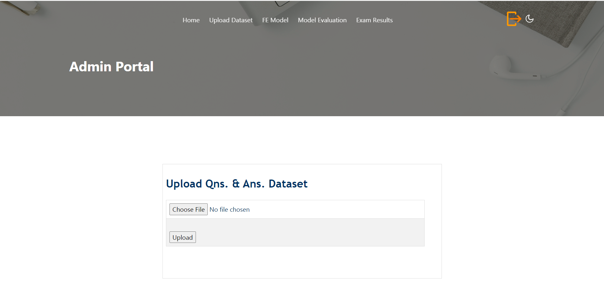
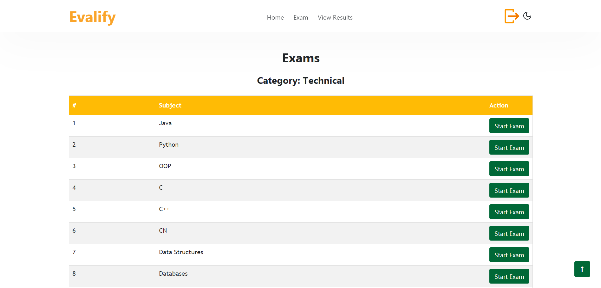

# **AI-Based Mock Interview Evaluator**

## **Abstract**
Interviews are a critical milestone for candidates, as they determine career outcomes based on their hard work and preparation. This project proposes an **AI-Based Mock Interview Evaluator**, a platform that bridges the gap between preparation and real interviews. 

The system evaluates candidates on three parameters:
1. **Emotions**: Judged through **Facial Expression Recognition (FER)** using a **CNN model**.
2. **Confidence**: Assessed through speech recognition using **Natural Language Processing (NLP)**.
3. **Knowledge Base**: Evaluated using **keyword mapping** and **semantic analysis**, with answers mapped to online resources for feedback.

This platform not only reduces interview stress and anxiety but also boosts confidence and communication skills.

---

## **System Features**
### ** Landing Page**
**Screenshot of User Exam Page:**

### **Admin Functionalities**
- Login to the system.
**Screenshot of User Exam Page:**


- Upload datasets.
  **Screenshot of User Exam Page:**


- Train the **CNN model** for facial expression recognition.
  **Screenshot of User Exam Page:**

- View performance metrics of trained models.
  **Screenshot of User Exam Page:**

- Access and review candidates' exam results.
  **Screenshot of User Exam Page:**


### **User Functionalities**
- **Sign up** and log in to the platform.
  **Screenshot of User Exam Page:**

- Choose between **Behavioral** and **Technical** categories:
  - Behavioral: General questions to evaluate confidence and communication.
  - Technical: Subject-specific questions in areas like Java, Python, C, C++, and OOP concepts.
  **Screenshot of User Exam Page:**

-Select Subjects
**Screenshot of User Exam Page:**

- Speak answers during the exam.
- View results with detailed feedback on:
  - Facial expression analysis.
  - Confidence level in speech.
  - Knowledge evaluation with suggestions for improvement.
**Screenshot of User Exam Page:**


## **System Functionalities**
- **Facial Expression Recognition (FER):** Uses a **CNN model** trained on Kaggle's FER dataset to classify emotions (e.g., happy, neutral, angry, sad, surprise).
- **Speech Processing:** Recognizes and processes spoken answers using **SpeechRecognition** and **PyAudio** libraries.
- **Grammar Verification:** Analyzes grammatical accuracy using **language_tool_python**.
- Provides **rule-based feedback** based on scores and performance.

---

## **Datasets**
- **FER Dataset:** Accessed from Kaggle, with categories like angry, disgust, happy, neutral, sad, and surprise.
- Dataset is split into training and validation sets for CNN model preparation.
- Stored separately due to its size (Refer to dataset instructions below).

---

## **Technologies and Libraries**
- **Python Version:** 3.6
- **Python Frameworks:** Django, OpenCV, Keras
- **Libraries for FER:** OpenCV, Keras, TensorFlow
- **Speech and Text Processing:** SpeechRecognition, PyAudio, language_tool_python
- **Web Scraping:** BeautifulSoup, Requests
- **Frontend:** HTML, CSS, JavaScript
- **Database:** SQLite/MySQL

---

## **Setup Instructions**

### **Clone the Repository**
```bash
git clone https://github.com/your-username/ai-mock-interview-evaluator.git
cd ai-mock-interview-evaluator
```

### **Install Required Libraries**
```bash
pip install -r requirements.txt
```

### **Dataset Upload**
`1.`Download the FER Dataset from Kaggle.
`2.`Add the dataset to the /datasets folder.

### **Run the Application**
```bash
python manage.py runserver
```
-Access the application at http://127.0.0.1:8000
